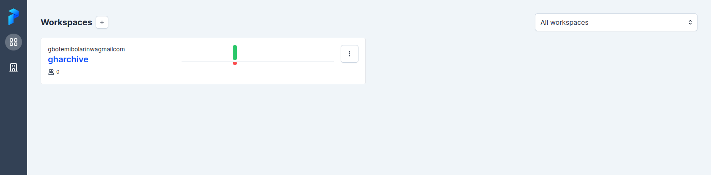
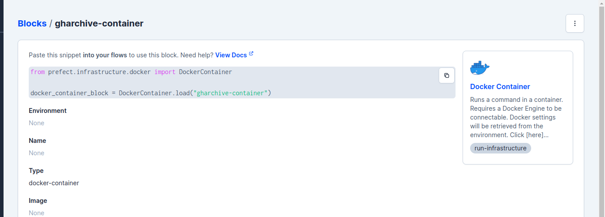
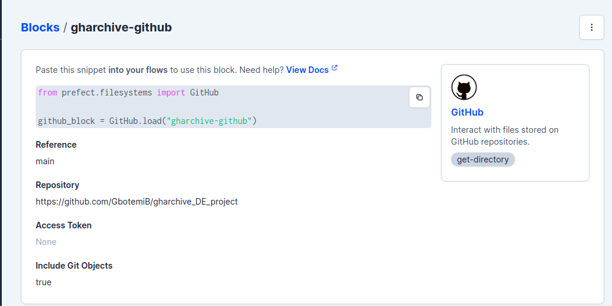

# GHArchive DE project
This is a  Data Enginerering Project using [Github Archive data](https://www.gharchive.org/)

## Problem Description
This project is about events that happens on [Github](https://www.github.com/). How many users are currently in the Github space? Which repo is the most contributed to? Who has the highest commits? What time of the day or month does users push commits the most? 

The Main Objective is to :
* develop a pipeline to collect data and process it in batch
* build a dashboard to visualize the trends 

## Technologies
* Cloud: GCP
* Infrastructure as code (IaC): Terraform
* Workflow orchestration: Prefect
* Data Warehouse: BigQuery
* Data Lake: Google Cloud Storage
* Batch processing/Transformations: dbt cloud and Spark
* Dashboard: Google Data Looker Studio

## Project Architecture
The data pipeline involves the following:
* fetching data in batches and storing it in GCS
* preprocessing the data with pyspark and moving it to DWH
* transforming and preparing the data in the DWH for visualization
* creating dashboards
  


## Dashboard


## Setup

to setup this project, [GCP account](https://cloud.google.com/) will be required.

Instructions to setup Terraform and GCP infrastruture [click here](terraform/README.md)

login into the google compute instance using ssh. to setup gcp with vscode [click here](https://www.youtube.com/watch?v=ae-CV2KfoN0&list=PL3MmuxUbc_hJed7dXYoJw8DoCuVHhGEQb&index=13)

### Installing java runtime and spark
create a directory for the installation and enter the directory
```
mkdir spark && cd spark
```
```shell
wget https://download.java.net/java/GA/jdk11/13/GPL/openjdk-11.0.1_linux-x64_bin.tar.gz
```
extract the file
```
tar xzvf openjdk-11.0.1_linux-x64_bin.tar.gz
```
download spark
```
wget https://dlcdn.apache.org/spark/spark-3.3.2/spark-3.3.2-bin-hadoop3.tgz
```
extract the file
```
tar xzfv spark-3.3.2-bin-hadoop3.tgz
```

to add the java and spark to path
```
nano ./bashrc 
```
scroll to the bottom and add the following
```
export JAVA_HOME="${HOME}/spark/jdk-11.0.1"
export PATH="${JAVA_HOME}/bin:${PATH}"

export SPARK_HOME="${HOME}/spark/spark-3.3.2-bin-hadoop3"
export PATH="${SPARK_HOME}/bin:${PATH}"
```
after exiting, 
logout and login back into the session to effect the changes or run `source ~/.bashrc`

### Installing Docker

```
sudo apt install docker.io
```
to run doocker without sudo

```
sudo groupadd docker
sudo usermod -aG docker $USER
```

logout and login back, then run `docker run hello-world` to test the installation.

### For Github repo
```
git clone https://github.com/GbotemiB/gharchive_DE_project/
```

app.prefect.cloud
* create a prefect cloud account
* create a workspace
  
* to set api keys, go to [my profile](https://app.prefect.cloud/my/profile), click on `API Keys`, create api key, name the api key `login`, copy the key securely.

* go back to terminal on the vm, run the next command to install the requirement to run prefect
    ```
    pip install -r requirements.txt
    ```
    to authenticate with prefect cloud, run
    ```
    prefect cloud login
    ```
    choose `Paste an API key`
* blocks are available on prefect cloud. if you are running prefect locally, you might need to add the blocks 
  ```
  prefect block register -m prefect_gcp
  prefect block register -m prefect_github
  prefect block register -m prefect_dbt
  prefect block register -m prefect_docker
  ```
* configure gcp bucket block
  
  * click the + to configure a block
  * go to GCS Bucket
  * name the block `gharchive`
  * get your gcp bucket name that was created in terraform setup. use it for the name of the bucket `gharchive-data`
  * scroll down to Gcp Credentials to add credentials. Click `Add +` to add gcp credentials.
  * let the name of the block name be `gcp-creds`
  * the api key that was downloaded when setting up GCP. copy the contents to `Service Account Info (Optional)` and save it.
  * the credential will be added to the gcp block automatically. click save
  
  * creating docker container block. go back to blocks and search for docker container. Name the block as `gharchive-container`
  
  * create a link to dbt readme, then continue setup for dbtcloud credentials. create a DbtCloudCredentials. Name the block as `dbt-gharchive`. paste your account ID. The api access key can be gotten from your dbt settings. copy it and paste it in DbtCloudCredentials block. Then save it.
  
  * go to `main/dbt_run.py` to input your job_id. replace your job_id in the job_id variable. 
* github block
  * search github in blocks, add it, enter the reference as main, the repository will be `https://github.com/GbotemiB/gharchive_DE_project`
  
  * go back to terminal to configure deployment and run the following commands.
  
    ```
    prefect deployment build code/main.py:pipeline \
      -n "deployment flow" \
      -o "deployment_flow" \
      -sb github/gharchive-github \
      --apply
    ```

    ```
    prefect agent start -q 'default'
    ```
    
    

    * visit app.prefect.cloud to run deployment. go to the deployment tab. the newly created tab should appear. Click on run to create a custom run. For testing, set the year parameter to a year e.g 2020; set the month to take just a single month in a list e.g [1] which means January; set the day to any day of the month e.g 1 which means the first day. Note if the day parameter is not set, this will run for every day in the chosen month.
    * the prefect flow run can be monitored from the terminal session running prefect agent. 

### Visualization
* visit [Google Looker Studio](https://lookerstudio.google.com/)
* create a datasource, select bigquery as source. select your project_ID, then select production dataset, select the `gh table`, then select connect on the right top corner. 
* You can have fun creating any dashboard of your choice.
  

when you are done, dont forget to tear down the infrastructure with `terraform destroy`
  


