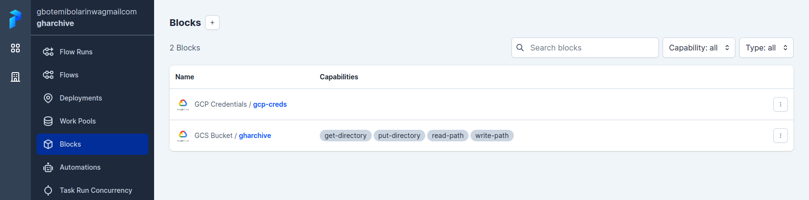
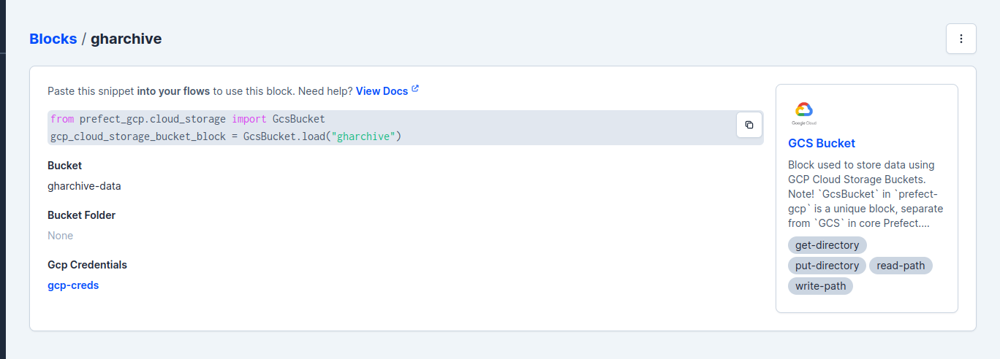
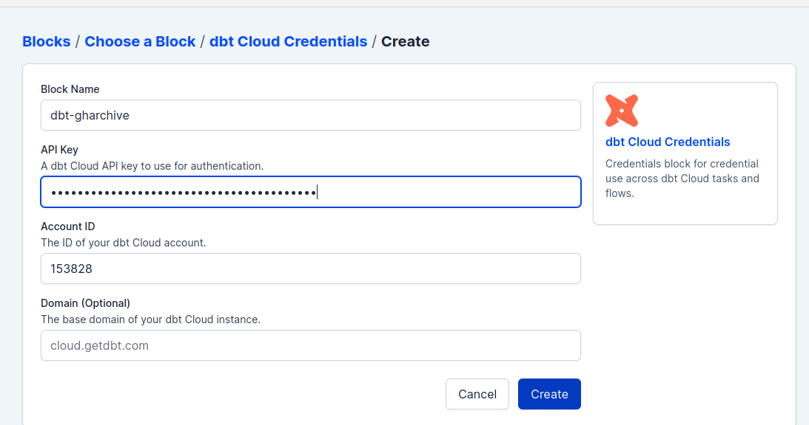
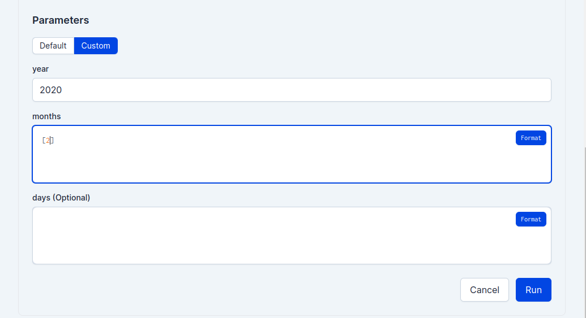
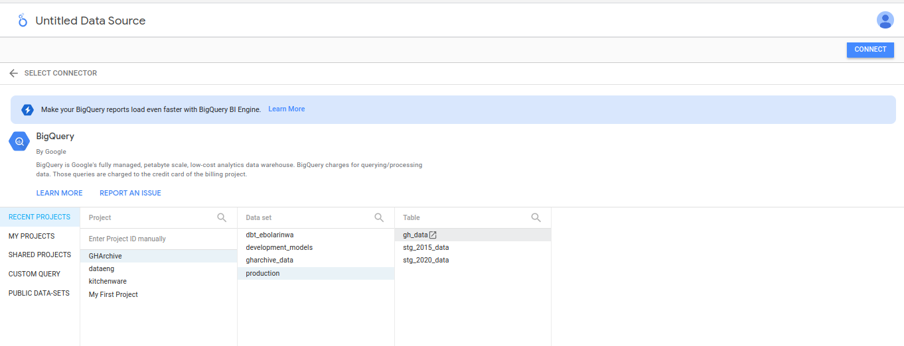

# GHArchive DE project
This is a  Data Enginerering Project using [Github Archive data](https://www.gharchive.org/)


- [GHArchive DE project](#gharchive-de-project)
  - [Problem Description](#problem-description)
  - [Technologies](#technologies)
  - [Project Architecture](#project-architecture)
  - [Dashboard](#dashboard)
  - [Setup](#setup)
    - [Terraform](#terraform)
    - [Java runtime and Spark](#java-runtime-and-spark)
    - [Github repo](#github-repo)
    - [Prefect](#prefect)
      - [GCP bucket block](#gcp-bucket-block)
    - [DBT Cloud](#dbt-cloud)
    - [Credentials](#credentials)
    - [Deployment](#deployment)
    - [Visualization](#visualization)

## Problem Description
This project is about events that happens on [Github](https://www.github.com/). How many users are currently in the Github space? Which repo is the most contributed to? Who has the highest commits? What time of the day or month does users push commits the most?

The Main Objective is to :
* Develop a pipeline to collect the github archive data and process it in batch
* Build a dashboard to visualize the trends

## Technologies
* Cloud: GCP
* Infrastructure as code (IaC): Terraform
* Workflow orchestration: Prefect
* Data Warehouse: BigQuery
* Data Lake: Google Cloud Storage
* Batch processing/Transformations: dbt cloud and Spark
* Dashboard: Google Data Looker Studio

## Project Architecture
The data pipeline involves the following:
* fetching data in batches and storing it in GCS
* preprocessing the data with pyspark and moving it to DWH
* transforming and preparing the data in the DWH for visualization
* creating dashboards


## Dashboard

[click here](https://lookerstudio.google.com/reporting/e3e5216b-45c4-48c7-8bdd-d65ab5431177) to see the dashboard

## Setup

To setup this project, [GCP account](https://cloud.google.com/) will be required. Activate your free trial with free $300 credit. select other when choosing what best describes your needs.

### Terraform
Instructions to setup Terraform and GCP infrastruture [click here](terraform/README.md)

login into the google compute instance using ssh. to setup gcp with vscode [click here](https://www.youtube.com/watch?v=ae-CV2KfoN0&list=PL3MmuxUbc_hJed7dXYoJw8DoCuVHhGEQb&index=13)

Note: The following instructions does not use docker to run the ochestration. To use docker [click here](docker.md)
### Java runtime and Spark
connect to your vm instance via vscode and continue.
create a directory for the installation and enter the directory
```
mkdir spark && cd spark
```
```
wget https://download.java.net/java/GA/jdk11/13/GPL/openjdk-11.0.1_linux-x64_bin.tar.gz
```
extract the file
```
tar xzvf openjdk-11.0.1_linux-x64_bin.tar.gz
```
download spark
```
wget https://dlcdn.apache.org/spark/spark-3.3.2/spark-3.3.2-bin-hadoop3.tgz
```
extract the file
```
tar xzfv spark-3.3.2-bin-hadoop3.tgz
```

to add the java and spark to path
```
nano ~/.bashrc
```
scroll to the bottom and add the following
```
export JAVA_HOME="${HOME}/spark/jdk-11.0.1"
export PATH="${JAVA_HOME}/bin:${PATH}"

export SPARK_HOME="${HOME}/spark/spark-3.3.2-bin-hadoop3"
export PATH="${SPARK_HOME}/bin:${PATH}"
```
after exiting,
logout and login back into the session to effect the changes or run `source ~/.bashrc`


### Github repo
Go to this [repo](https://github.com/GbotemiB/gharchive_DE_project/), fork it and clone the forked repo

### Prefect
We will running prefect locally here.
* go back to terminal on the vm, run the next command to install the requirement to run prefect.
  run `sudo apt update && sudo apt install python3-pip` to install pip package manager. Then change directory into the cloned repo, then run the following.

    ```
    pip install -r requirements.txt
    ```
    then run `sudo reboot now` to reboot vm instance to effect installation.
* run `prefect orion start` to start prefect server.
* open another terminal session and run `prefect config set PREFECT_API_URL=http://127.0.0.1:4200/api`.

* The following block needs to be added.
  ```
  prefect block register -m prefect_gcp
  prefect block register -m prefect_dbt
  ```
* configuring prefect blocks. blocks can be configured with scripts or through the Prefect UI. The blocks will be configured via the UI.
  #### GCP bucket block
    
     * click the + to configure a block
     * go to GCS Bucket
     * name the block `gharchive`
     * get your gcp bucket name that was created in terraform setup. use it for the name of the bucket `gharchive_dataset_gcs`
     * scroll down to Gcp Credentials to add credentials. Click `Add +` to add gcp credentials.
     * let the name of the block name be `gcp-creds`
     * the api key that was downloaded when setting up GCP. copy the contents to `Service Account Info (Optional)` and save it.
     * the credential will be added to the gcp block automatically. click save
     
### DBT Cloud
  * Setup DbtCloud [here](/dbt/README.md).
  * To setup dbtcloud credentials block on prefect.
    * create a DbtCloudCredentials.
    * Name the block as `dbt-gharchive`.
    * paste your account ID.
    * The api access key can be gotten from your dbt settings. copy it and paste it in DbtCloudCredentials block. Then save it.
  
  * go to `code/dbt_run.py` to input your job_id. replace your job_id in the job_id variable.
### Credentials
  * go to the credentials folder and create `credentials.json` file.
  * copy the google credentials details into it and save it.


  ### Deployment
  * Go back to terminal to configure deployment 
  * change directory into the clone repo folder and running the following.
    ```
    export PYTHONPATH="${SPARK_HOME}/python/:$PYTHONPATH"
    export PYTHONPATH="${SPARK_HOME}/python/lib/py4j-0.10.9.5-src.zip:$PYTHONPATH"
    ```

    ```
    prefect deployment build code/main.py:pipeline \
      -n "pipeline flow" \
      -o "pipeline flow" \
      --apply
    ```
     - the -n parameter set the name of the deployment in prefect.
     - the -o parameter set the output of the file.
     - the -sb parameter set the storage block.
     - the --apply parameter apply the deployment file to prefect.

    ```
    prefect agent start -q 'default'
    ```

    

    * Visit [Prefect](http://127.0.0.1:4200/) to run deployment.
    * Go to the deployment tab. the newly created deployment should appear under the deployment tab.
    * Click on run to create a custom run. For test purposes,
      - set the year parameter to a year e.g 2020;
      - set the month to take just a single month in a list e.g [1] which means January;
      - set the day to any day of the month e.g 1 which means the first day. Note if the day parameter is not set, this will run for every day in the chosen month.
    * the prefect flow run can be monitored from the terminal session running prefect agent.

### Visualization
* visit [Google Looker Studio](https://lookerstudio.google.com/)
* create a datasource.
* select bigquery as source.
* select your project_ID.
* select production dataset.
* select the `gh table`.
* select connect on the right top corner.
  
* You can have fun creating any dashboard of your choice.


when you are done, dont forget to tear down the infrastructure with `terraform destroy`


[def]: #gharchive-de-project
