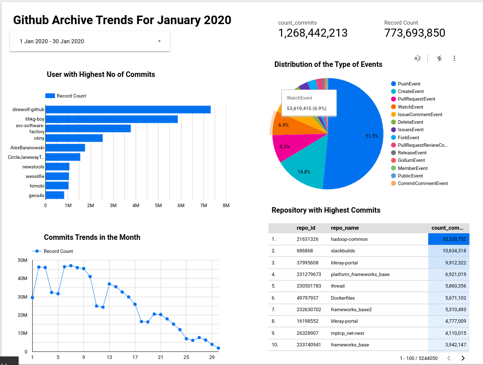

# GHArchive DE project
This is a  Data Enginerering Project using [Github Archive data](https://www.gharchive.org/)

## Problem Description
This project is about events that happens on [Github](https://www.github.com/). How many users are currently in the Github space? Which repo is the most contributed to? Who has the highest commits? What time of the day or month does users push commits the most? 

The Main Objective is to :
* develop a pipeline to collect data and process it in batch
* build a dashboard to visualize the trends 

## Technologies
* Cloud: GCP
* Infrastructure as code (IaC): Terraform
* Workflow orchestration: Prefect
* Data Warehouse: BigQuery
* Data Lake: Google Cloud Storage
* Batch processing/Transformations: dbt cloud and Spark
* Dashboard: Google Data Looker Studio

## Project Architecture
The data pipeline involves the following:
* fetching data in batches and storing it in GCS
* preprocessing the data with pyspark and moving it to DWH
* transforming and preparing the data in the DWH for visualization
* creating dashboards
  


## Dashboard


## Setup

to setup this project, [GCP account](https://cloud.google.com/) will be required.

Instructions to setup Terraform and GCP infrastruture [click here](terraform/README.md)

login into the google compute instance using ssh. to setup gcp with vscode [click here](https://www.youtube.com/watch?v=ae-CV2KfoN0&list=PL3MmuxUbc_hJed7dXYoJw8DoCuVHhGEQb&index=13)

### Installing java runtime and spark
create a directory for the installation and enter the directory
```
mkdir spark && cd spark
```
```shell
wget https://download.java.net/java/GA/jdk11/13/GPL/openjdk-11.0.1_linux-x64_bin.tar.gz
```
extract the file
```
tar xzvf openjdk-11.0.1_linux-x64_bin.tar.gz
```
download spark
```
wget https://dlcdn.apache.org/spark/spark-3.3.2/spark-3.3.2-bin-hadoop3.tgz
```
extract the file
```
tar xzfv spark-3.3.2-bin-hadoop3.tgz
```

to add the java and spark to path
```
nano ./bashrc 
```
scroll to the bottom and add the following
```
export JAVA_HOME="${HOME}/spark/jdk-11.0.1"
export PATH="${JAVA_HOME}/bin:${PATH}"

export SPARK_HOME="${HOME}/spark/spark-3.3.2-bin-hadoop3"
export PATH="${SPARK_HOME}/bin:${PATH}
```
after exiting, 
logout and login back into the session to effect the changes or run `source ~/.bashrc`

### Installing Docker

```
sudo apt install docker.io
```
to run doocker without sudo

```
sudo groupadd docker
sudo usermod -aG docker $USER
```

logout and login back, then run `docker run hello-world` to test the installation.

### For Github repo
```
git clone https://github.com/GbotemiB/gharchive_DE_project/
```

app.prefect.cloud
* create a prefect cloud account
* create a workspace
* to set api keys, go to [my profile](https://app.prefect.cloud/my/profile), click on `API Keys`, create api key, name the api key `login`, copy the key securely.

* go back to terminal on the vm, run the next command to install the requirement to run prefect
    ```
    pip install -r requirements.txt
    ```
    to authenticate with prefect cloud, run
    ```
    prefect cloud login
    ```
* creating Blocks in prefect
* pnu_tK1tYE1aCkK8E7y8rWVcNCGUg47XUg0mU5T4