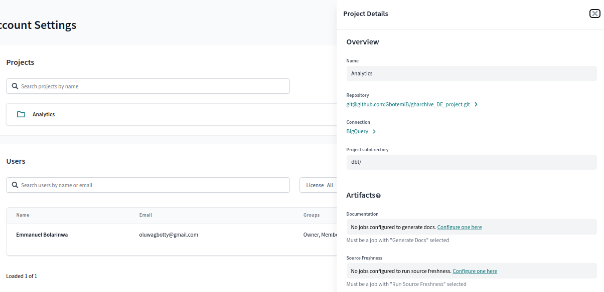
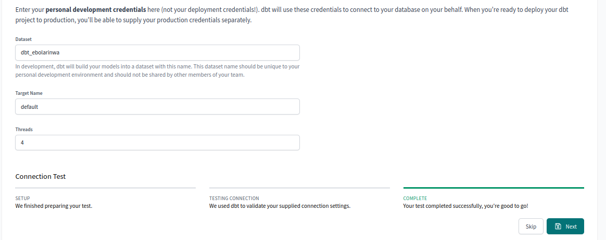

# DBT Cloud Setup
  * Create an account on [DBT cloud](https://cloud.getdbt.com/).
  * Set up project
  * Go back to [Gharchive](https://github.com/GbotemiB/gharchive_DE_project) to fork the repository.
  * Follow the instructions [here](https://github.com/DataTalksClub/data-engineering-zoomcamp/blob/main/week_4_analytics_engineering/dbt_cloud_setup.md) to setup project.
  * The project directory has to be changed to `/dbt`. Go to settings. click on the project folder. Then edit the Project subdirectory to `/dbt`.
   
  * Lets create a production environment. go to deploy, then environment. create a new environment with the name, production.
  * You can name the dataset for the deployment credentials `production`.
   
  * Lets create a job for our transformation. Name the Job, the production environment will be selected automatically.
  * Enable generate docs on run and source refreshness.
  * Edit the command to `dbt build --select +gh_data`.
  * We will trigger the run with prefect, so no need to add triggers.
  * Copy the web address of the dbt job link.
  
  * The digits after deploy in the link is the user_id, while the link after the jobs is the job_id. we will need it in setting triggers with prefect.
  

Continue the setup [here](../README.md)
