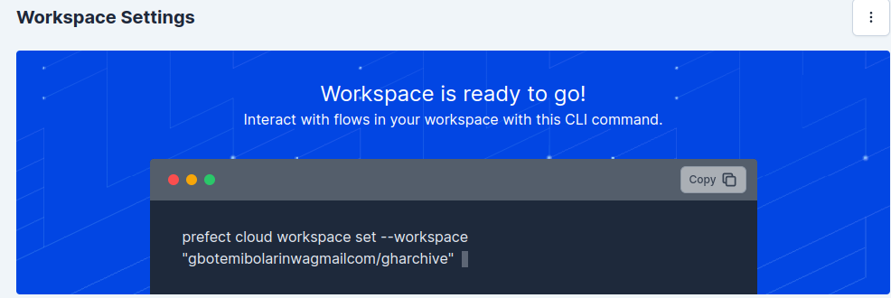

## Docker
Run the following command to install docker
```
sudo apt install docker.io
```
to run doocker without sudo

```
sudo groupadd docker
sudo usermod -aG docker $USER
```

logout and login back, then run `docker run hello-world` to test the installation.

Setup Prefect account [here](https://github.com/GbotemiB/gharchive_de_project#prefect)
create `prefect_key.txt` file and save your prefect api key inside.

To get your workspace details, go to [prefect](https://app.prefect.cloud), go to workspace settings.


Open the `Dockerfile`. go to the bottom page, edit and set your prefect workspace details.

Open a new terminal session and run the following command to build docker image.
```
docker build -t spark:v1 .
```
After the image has been successfully built. Run `docker-compose up` to start prefect agent.

### Deployment
* Visit [Prefect Cloud](https://app.prefect.cloud) to run deployment.
    * Go to the deployment tab. the newly created deployment should appear under the deployment tab.
    * Click on run to create a custom run. For test purposes,
      - set the year parameter to a year e.g 2020;
      - set the month to take just a single month in a list e.g [1] which means January;
      - set the day to any day of the month e.g 1 which means the first day. Note if the day parameter is not set, this will run for every day in the chosen month.
    * the prefect flow run can be monitored from the terminal session running prefect agent.

[click here](https://github.com/GbotemiB/gharchive_de_project#visualization) to continue with visualization of the data.