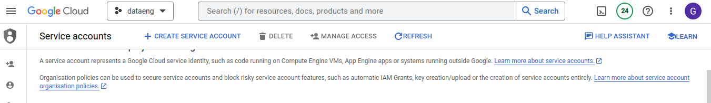
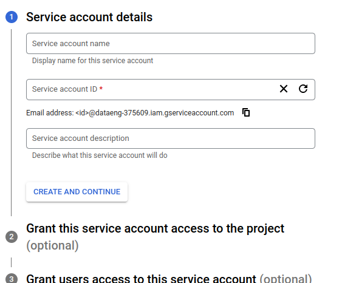
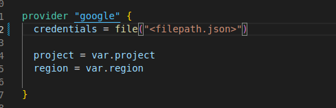
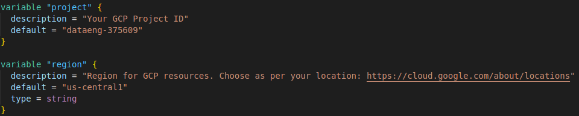
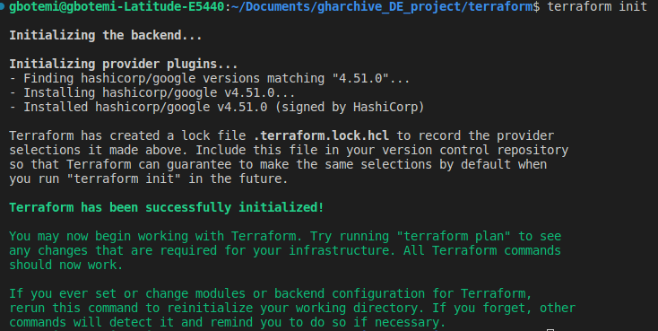
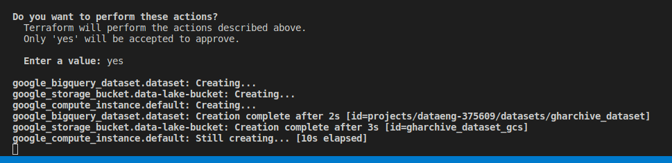
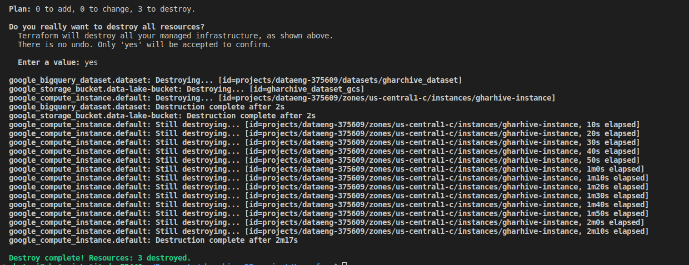

## Terraform Overview

This contains instruction on how to create a Google cloud storage, Google storage buckets and Google compute engine using [Terraform](https://www.terraform.io)

### Introduction

1. What is [Terraform](https://www.terraform.io)?
   * open-source tool by [HashiCorp](https://www.hashicorp.com), used for provisioning infrastructure resources
   * supports DevOps best practices for change management
   * Managing configuration files in source control to maintain an ideal provisioning state
     for testing and production environments
2. What is IaC?
   * Infrastructure-as-Code
   * build, change, and manage your infrastructure in a safe, consistent, and repeatable way
     by defining resource configurations that you can version, reuse, and share.
3. Some advantages
   * Infrastructure lifecycle management
   * Version control commits
   * Very useful for stack-based deployments, and with cloud providers such as AWS, GCP, Azure, K8S…
   * State-based approach to track resource changes throughout deployments

## Getting Started

### Installing Terraform
visit [Terraform Download page](https://developer.hashicorp.com/terraform/downloads) to download either for windows, linux or Mac OS. Also follow the instructions to setting Terraform.
To verify your installation, run `terraform -help`

### Creating GCP infrastructure with Terraform

#### Requirements

* A google cloud platform account. If you don't have one, you can create a free account thats comes with a $300 credit [here](https://console.cloud.google.com/freetrial/)

#### Setting up GCP
* A GCP project. [create one here](https://console.cloud.google.com/projectcreate). Keep note of your Project ID. it should look like this `PROJECT_NAME-453233`
* Enable Compute Engine for your project in the [GCP Console](https://console.developers.google.com/apis/library/compute.googleapis.com)
* [Create a Service Account key](https://console.cloud.google.com/apis/credentials/serviceaccountkey). This will used throughout the entire project.
  * Select the project you created in the previous step
  * Navigate to the [IAM section](https://console.cloud.google.com/iam-admin/serviceaccounts)
  * Click on Create Service account

  * choose a name of your choice, then create and continue

  * Select Role. Since we will be using this service account for the project, then we will select all the roles that will be needed.
    * BigQuery Admin
    * Compute Admin
    * Storage Admin
  * Skip granting additional users access, and click "Done".

After you create your service account, download your service account key.

* Select your service account from the list.
* Select the "Keys" tab.
* In the drop down menu, select "Create new key".
* Leave the "Key Type" as JSON.
* Click "Create" to create the key and save the key file to your system.

#### Creating GCP infrasture with Terraform
* create a directory `mkdir gcp-terraform`
* enter into the directory `cd gcp-terraform`
* create a new file `touch main.tf` and copy the content of [main.tf](./main.tf) into it
* copy the filepath of your service key account and paste it in the `filepath.json` in the `main.tf` files
  
* create another file in the same directory `touch variables.tf` and copy the content of [variables.tf](./variables.tf) into it
* Configure the variables in `variables.tf`
  

  * set your project_id, region, BQ_DATASET, cloud_storage, compute_instance

* open terminal and run `terraform init` to initialize files. This might take a few mins.
  
* run `terraform plan` to see the infrastructure to be created.
* run `terraform apply` to create the infrasture. a prompt will be ask, type `yes` to preceed.
  

You have successfully created a compute engine, a cloud storage bucket and a bigquery warehouse. run `terraform show` to see the configurations.

* to destroy the infrasture, run `terraform destroy` and wait a few mins.
  

continue setup [here](../README.md)
